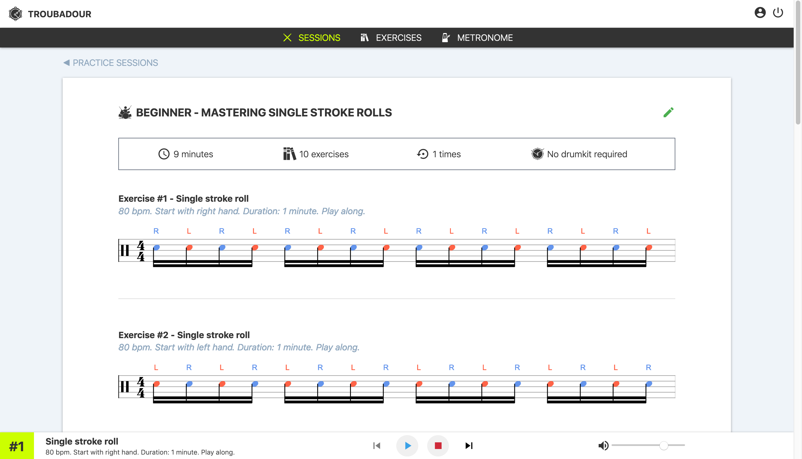

# Troubadour

**Troubadour** is web application that allows your to practice your drums rudiments. Create your own session and practice to your liking.

## Technical stack

This application is built with:

- Angular 8 & AngularCLI
- Firebase (Firebase Real-Time Database and Authentication)

### Getting started

#### Development server

Run `ng serve` for a dev server. Navigate to `http://localhost:4200/`. The app will automatically reload if you change any of the source files.

#### Code scaffolding

Run `ng generate component component-name` to generate a new component. You can also use `ng generate directive|pipe|service|class|guard|interface|enum|module`.

#### Build

Run `ng build` to build the project. The build artifacts will be stored in the `dist/` directory. Use the `--prod` flag for a production build.

#### Running unit tests

Run `ng test` to execute the unit tests via [Karma](https://karma-runner.github.io).

#### Running end-to-end tests

Run `ng e2e` to execute the end-to-end tests via [Protractor](http://www.protractortest.org/).

#### Further help

To get more help on the Angular CLI use `ng help` or go check out the [Angular CLI README](https://github.com/angular/angular-cli/blob/master/README.md).

## Licence

[CC BY-NC 4.0](./LICENCE.md)

You are free to:

- **Share** — copy and redistribute the material in any medium or format
- **Adapt** — remix, transform, and build upon the material

Under the following terms:

- **Attribution** — You must give appropriate credit, provide a link to the license, and indicate if changes were made. You may do so in any reasonable manner, but not in any way that suggests the licensor endorses you or your use.

- **NonCommercial** — You may not use the material for commercial purposes.

No additional restrictions — You may not apply legal terms or technological measures that legally restrict others from doing anything the license permits.
